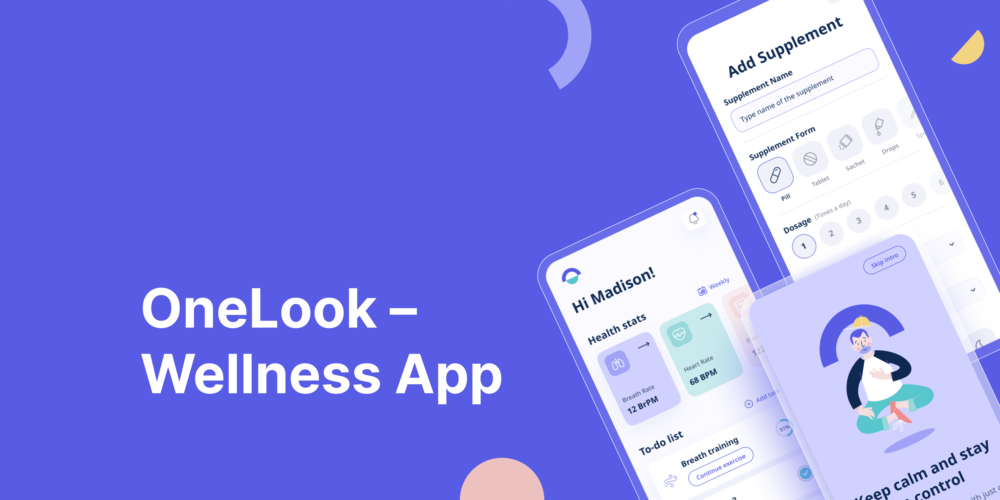
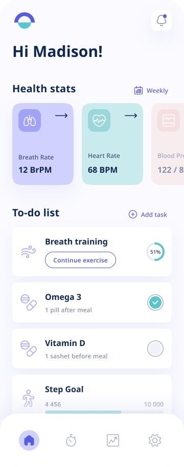
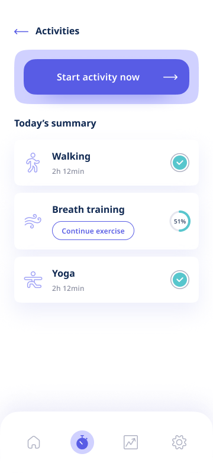

# OneLook 🧠🏃‍♂️

**OneLook** is a mobile application built using **Flutter**, aiming to simplify your health and wellness journey. It helps users stay consistent with daily habits through **timely reminders** and **fitness tracking features**.   
✨ _Designed with usability and simplicity in mind, OneLook encourages a more mindful, active lifestyle._

---

## 📘 About This Project

This project is part of a self-initiated effort to create an all-in-one solution for **reminders and fitness tracking**, especially for students and working professionals. It is designed to support consistent daily routines while promoting physical activity and self-discipline.

Built using **Flutter**, OneLook focuses on:

- A clean, intuitive UI
- Effective reminder management
- Daily step tracking and physical activity logs
- Health-oriented notifications and insights

---

## 📱 Concept Designs

Here are some early previews of OneLook’s interface:

  
  

> *Additional UI updates and improvements are on the way!*

---

## 🖌️ Design Credits

The application design is inspired by the beautiful and minimalistic work of [**Weronika Kołodziej-Teszbir**](https://dribbble.com/weronika-kolodziej).  
We are grateful for her visual style and aesthetic inspiration that shaped OneLook's clean interface.

---

## 🤝 Contributions & Credits

This project is developed and maintained by [Your Name](https://github.com/yourusername).  
Feel free to fork, contribute, or give feedback!

---

## 📩 Feedback

If you have any ideas, feature requests, or spot a bug, feel free to open an issue or connect via [LinkedIn](https://linkedin.com/in/yuga-jaiswal).
